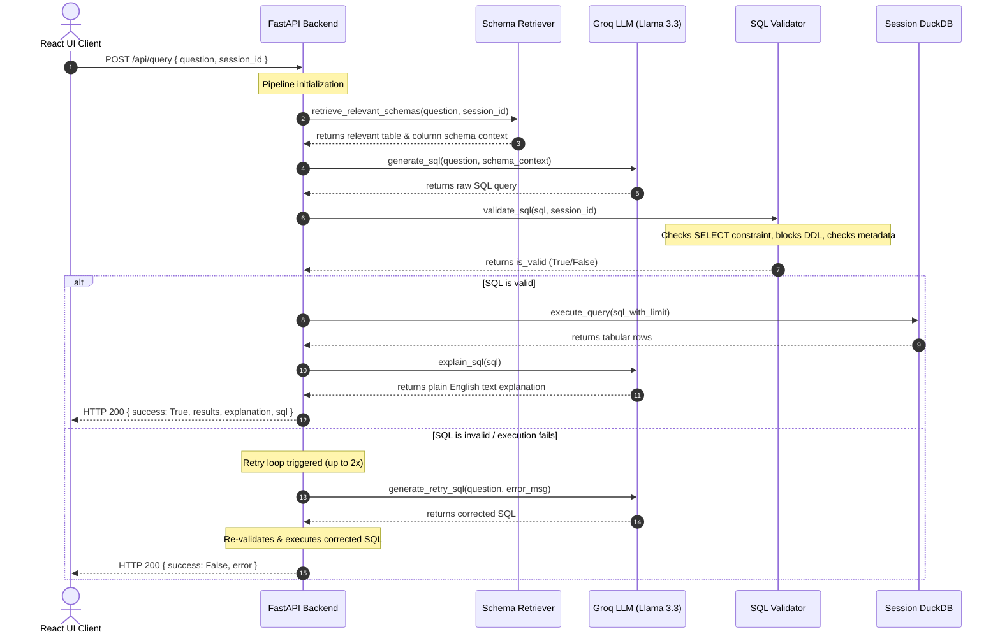

# AskSQL — Project Overview & Architecture

AskSQL is a full-stack, zero-dependency, memory-optimized web application that translates natural language questions (e.g., *"Show the top 3 cities with the highest number of customers"*) into safe, execution-valid SQL queries. It runs them in an isolated DuckDB sandbox, presents the tabular results in real time, and explains the SQL query in plain English using Llama 3 via Groq.

---

## 🚀 Key Features

*   **Natural Language to SQL:** Translates plain English business questions into valid SQL SELECT queries.
*   **Plain English Explanation:** Automatically generates a human-readable explanation of what the generated query does.
*   **Dynamic CSV Uploads:** Users can upload their own CSV files, which are automatically parsed, type-inferred, and loaded into isolated session-specific DuckDB databases.
*   **Sample Datasets:** One-click mounting of pre-packaged e-commerce (Olist) dataset tables.
*   **Zero-Dependency Schema Retriever:** A lightweight, token-matching relevance search algorithm that retrieves top-k relevant database schemas as LLM context, bypassing heavy neural embedding models.
*   **Multi-Layer Safety Validation:** An integrated security validator that ensures queries are strictly read-only, checks schema metadata to prevent injections/hallucinations, and enforces row limits and timeouts.
*   **Low-Memory Footprint:** Fully optimized to run on low-resource environments (such as Render's 512MB RAM free tier).

---

## 🏗️ Architecture & Request Flow

AskSQL is designed around a session-isolated, pipeline-based request execution pattern:



---

## 💻 Tech Stack

| Layer | Technology | Purpose / Notes |
| :--- | :--- | :--- |
| **Frontend** | React (Vite) + Tailwind CSS | Sleek responsive dashboard, glassmorphism UI, real-time results table, schema browser, and chat history. |
| **Backend** | Python + FastAPI + Uvicorn | Asynchronous HTTP endpoints, CORS middleware, session lifecycle management, and clean routing. |
| **Database** | DuckDB | Session-isolated SQL database files (`.db`). Extremely fast, lightweight, and supports native SQL. |
| **LLM Engine** | Groq API (`llama-3.3-70b-versatile`) | Blazing fast inference for generating SQL and English explanations. |
| **Safety Engine** | Python AST & Metadata Matching | Static query validation rejecting dangerous statements and validating table/column existence. |

---

## ⚡ Memory Optimization (Render Free-Tier Friendly)

Initially, the application exceeded **512MB RAM**, causing Out-Of-Memory (OOM) crashes on Render. The following optimizations were made to make the codebase extremely lightweight and free-tier friendly:

1.  **Removed Pandas Dependency:** 
    *   *Problem:* Importing `pandas` and its dependencies (like `numpy`) added a ~70–100MB baseline memory overhead on startup. When parsing large CSV uploads (e.g., `orders.csv` ~17MB), Pandas DataFrames ballooned in memory.
    *   *Solution:* Removed `pandas` completely. Replaced CSV ingestion with **DuckDB's native C++ `read_csv_auto()`** parser.
2.  **On-Disk Streaming Ingestion:**
    *   Uploaded files are immediately saved as temporary CSV files and read into DuckDB using stream processing, bypassing python heap allocations.
    *   For pre-packaged sample files, we pass the file paths directly to DuckDB instead of loading the bytes into Python's memory first.
3.  **Removed ChromaDB & Sentence-Transformers:**
    *   *Problem:* Embedding models (`all-MiniLM-L6-v2`) and local vector stores consumed upwards of 350MB of RAM.
    *   *Solution:* Replaced with a lightweight token-matching keyword matcher that scores table schemas by query token intersections. This achieves identical schema retrieval precision without the heavy model overhead.
4.  **Single Worker Configuration:**
    *   Ensured Uvicorn runs with a single worker thread, minimizing the memory footprint to a baseline of only **~60MB**.

---

## 📂 Codebase Directory Structure

```
AskSQL/
│
├── backend/
│   ├── app/
│   │   ├── config.py           # Environmental settings & constants
│   │   ├── main.py             # FastAPI App definition & endpoint routing
│   │   ├── db/
│   │   │   └── connection.py   # DuckDB read-only session execution + interrupts
│   │   ├── llm/
│   │   │   ├── explainer.py    # Generates plain English explanations via Groq
│   │   │   └── sql_generator.py # Synthesizes SQL and handles auto-retries via Groq
│   │   ├── rag/
│   │   │   └── retriever.py    # Zero-dependency schema retriever (token match)
│   │   ├── routers/
│   │   │   └── query.py        # /query POST route executing the LLM-SQL pipeline
│   │   ├── upload/
│   │   │   ├── csv_parser.py   # DuckDB-powered CSV streaming and sanitization
│   │   │   ├── schema_generator.py # Auto-generates column descriptions using Groq
│   │   │   └── session_manager.py  # Session directory disk persistence & background sweep
│   │   └── validator/
│   │       └── sql_validator.py # Syntax filters & whitelist metadata validator
│   │
│   ├── data/
│   │   └── sample_datasets/    # Pre-packaged Olist CSV dataset files
│   ├── eval/
│   │   ├── eval_questions.json # 20 ground-truth questions benchmark suite
│   │   ├── run_eval.py         # Evaluates pipeline SQL against seed PostgreSQL
│   │   └── test_upload.py      # Integration testing tool
│   └── requirements.txt        # Production dependency packages (Pandas/Chroma removed)
│
├── frontend/
│   ├── src/                    # React components, sidebar, and styles
│   ├── package.json            # Vite React script configurations
│   └── tailwind.config.js      # Styling configuration tokens
│
└── PROJECT_OVERVIEW.md         # Project documentation (this file)
```

---

## 🛡️ Safety & Validation Layer Details

To prevent malicious attacks (SQL Injection, database deletions, metadata enumeration), a strict validation sequence checks all SQL strings:

1.  **Read-Only SELECT Constraint:** The query must start case-insensitively with `SELECT` (trailing/leading whitespace stripped).
2.  **Keyword Blacklist:** Instantly blocks queries containing mutations: `DROP`, `DELETE`, `UPDATE`, `INSERT`, `ALTER`, `TRUNCATE`, `CREATE`, etc.
3.  **Stacked Statement Block:** Prevents query stacking using semicolons followed by non-whitespace statements (blocks `SELECT ...; DROP TABLE ...`).
4.  **Comment Filters:** Rejects `--` and `/* */` sequences used to comment out trailing database-enforced safety checks.
5.  **Metadata Identifier Whitelisting:** Scrapes the parsed AST identifiers and verifies that every table and column referenced exists in the active session's schema. Bypasses requests to system/internal tables (e.g., `sqlite_master`, `pg_catalog`).
6.  **Hard Row Limits:** Appends `LIMIT 500` if the query doesn't specify one.
7.  **Timeout Interrupts:** Thread-monitored timer cancels execution if the query runs longer than 5 seconds.

---

## 🌐 How to Deploy to Render (Free Tier)

### 1. Backend Web Service
1.  Create a **Web Service** on Render pointing to your backend folder.
2.  **Environment:** Choose `Python`.
3.  **Build Command:** 
    ```bash
    pip install -r backend/requirements.txt
    ```
4.  **Start Command:**
    ```bash
    uvicorn backend.app.main:app --host 0.0.0.0 --port $PORT
    ```
5.  **Environment Variables:**
    *   `GROQ_API_KEY`: Your Groq API key (`gsk_...`)
    *   `SESSIONS_DIR`: `./backend/sessions`
6.  **Plan:** Choose `Free` (512MB RAM).

### 2. Frontend Static Site
1.  Create a **Static Site** on Render pointing to your frontend folder.
2.  **Build Command:** `npm run build`
3.  **Publish Directory:** `dist`
4.  **Environment Variables:**
    *   `VITE_API_BASE_URL`: URL of your deployed FastAPI Backend Web Service.
